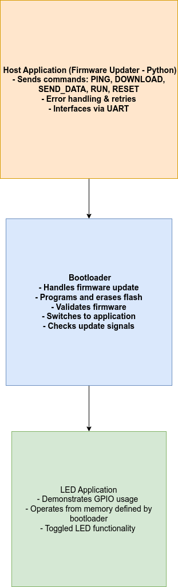

# TivaC_RemoteUpdater_Demo

## Overview
The **TivaC_RemoteUpdater_Demo** showcases a robust system for remotely updating firmware on Tiva C Series microcontrollers. This project demonstrates:
1. A **bootloader** for secure and efficient firmware updates.
2. An **LED application** to demonstrate GPIO functionality.
3. A Python-based **remote firmware updater** for seamless communication between the host and target.

---

## Features

### Bootloader
- **Firmware Update via UART**:
  - Handles commands like `PING`, `DOWNLOAD`, `SEND_DATA`, `RUN`, and `RESET`.
  - Manages flash programming and erasure.
- **Application Switching**:
  - Transfers control to the updated application.
- **Fault Handling**:
  - Validates firmware integrity during updates.

### LED Application
- **GPIO Demonstration**:
  - Toggles an LED to verify functionality.
- **Configurable Memory Location**:
  - Defined by the bootloader for separation.

### Firmware Updater
- **Cross-Platform**:
  - Python-based, runs on Linux, macOS, and Windows.
- **Command-Based Communication**:
  - Reliable transfer with retry mechanisms.
  - Handles commands like `PING`, `DOWNLOAD`, `SEND_DATA`, `RUN`, and `RESET`.

---

## Project Structure

```plaintext
.
├── bootloader             # Source code for the bootloader
│   ├── Debug              # Build artifacts
│   └── targetConfigs      # Target configuration files
├── led_application        # Source code for the LED application
│   ├── Debug              # Build artifacts
│   └── targetConfigs      # Target configuration files
├── firmware_updater       # Python-based host application
│   ├── main.py            # Entry point for the updater
│   ├── packet_handler.py  # Manages communication with the bootloader
│   └── uart_handler.py    # Handles UART communication
└── tools                  # Utilities and setup scripts
    └── ccs_project_setup.sh # CCS environment setup script
```

## Memory Map Explanation

### Memory Layout
| Address Range  | Section                     | Description                                 |
|----------------|-----------------------------|---------------------------------------------|
| `0x0000_0000`  | Bootloader Vector Table     | Initial entry point and ISR table.          |
| `0x0000_2800`  | Application Start           | Memory location for the LED application.    |
| `0x2000_0000`  | SRAM                        | Shared memory for stack and heap.           |

### Bootloader and Application Interaction
- The bootloader checks for update signals in SRAM.
- Upon successful update, control is transferred to the application at `0x0000_2800`.

---

## Getting Started

### Prerequisites
**Hardware:**
- Tiva C microcontroller (e.g., TM4C123GH6PM).

**Software:**
- Code Composer Studio (CCS)
- TivaWARE
- Python 3.x with `pyserial`

### Setup
1. Clone the repository:
    ```bash
    git clone https://github.com/<your-username>/TivaC_Firmware_Update_Demo.git
    cd TivaC_Firmware_Update_Demo
    ```

2. Set up the CCS workspace:
    ```bash
    bash tools/ccs_project_setup.sh
    ```

3. Build the `bootloader` and `led_application` projects in CCS.

---

## Usage

### Running the Firmware Updater
1. Use the `main.py` script to update firmware:
    ```bash
    python3 firmware_updater/main.py
    ```

### Observe Behavior
**LED Application:**
- The bootloader transfers control to the application after a successful update.
- The LED toggles as programmed.

**Error Recovery:**
- The updater retries commands to ensure robust communication.


## System Architecture

The following diagram illustrates the system architecture:


